The `mrbuild` utility is a Go application that can determine what files have changed between branches and then kick off the appropriate build in a project folder within the repo.

> necessity is the mother of invention (John Locke 1776)

This tool was developed to get around an issue where it was not possible to have validating builds on a GitHub Pull Request when using Azure DevOps as the CI/CD tool on a mono repo. For a detailed explanation of the reason please refer to the Reasons section.

There are other applications, such as https://nx.dev/, which can detect changes in folders. However these are NodeJS based and as such require the NodeJS ecosystem in order to work.

As `mrbuild` is a Go based application it is a single binary that can be run on Windows, Linux and Mac OS. It is designed to be downloaded by a CI/CD system and then run as the entry point to the builds in the mono repo. If any changes are found in project folders it will spawn the build as describes in a configuration file.

.Application process flow
