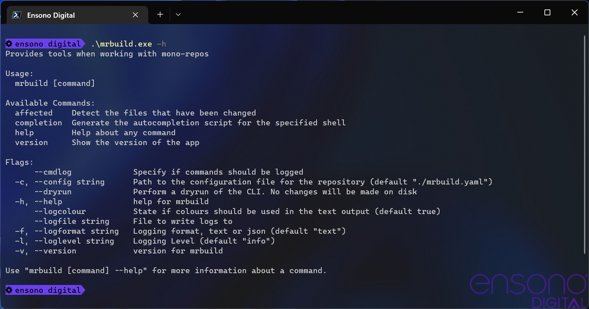
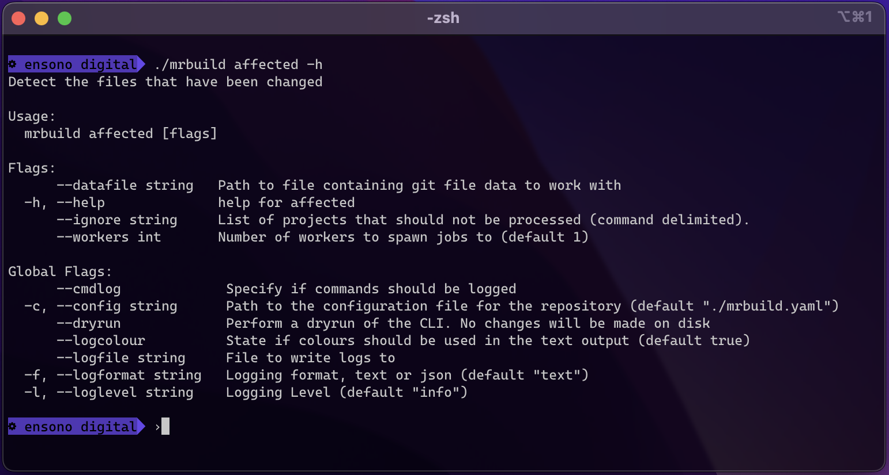

:envvar-prefix: MRBUILD_

== Usage

The `mrbuild` command is a simple Go based application that runs on the command line.

As is common with most command line applications, help is built into the command. This can be accessed using the `-h | --help` argument.

.Help screen for `mrbuild` command

The help argument also works on sub commands, for example the following screen shot shows the command running on Mac OS.

.Help screen for the affected command

=== Command Arguments

The following tables show the global and command specific arguments.

.Global arguments
[cols="1,1,2a,1,1"]
|===
| Argument | Envvar | Description | Default |Example 
| `--cmdlog` | {envvar-prefix}OPTIONS_CMDLOG | States that a log of the external commands that `mrbuild` runs will be saved to an external file | false | `--cmdlog`
| `-c`, `--config` | {envvar-prefix}CONFIG |Path to the configuration file to be used when analysing a repository | | `-c ./mrbuild.yaml`
| `--dryrun` | {envvar-prefix}OPTIONS_DRYRUN | Perform a dry run of the process, e.g. do not execute any potentially destructive commands. | false | `--dryrun`
| `--logcolour` | {envvar-prefix}LOGCOLOUR | States if colours should be used in the logging output | true |
| `--logfile` | {envvar-prefix}LOGFILE | Path to a file to log all the output to | | `--logfile log.txt`
| `-f`, `--logformat` | {envvar-prefix}LOGFORMAT |Logging format to use. This can be either `text` or `json`. `json` is designed to be used for logging to external systems. | text |
| `-l`, `--loglevel` | {envvar-prefix}LOGLEVEL |Level of logging that output should be limited to. Can be any of:

* panic
* fatal
* error
* warn
* info
* debug
* trace

| info | `-l debug`
|===

.Affected command arguments
[cols="1,1,2a,1,1"]
|===
| Argument | Env Name | Description | Default |Example 
| `--datafile` | {envvar-prefix}DATAFILE | By default `mrbuild` will run the necessary `git` command to get a list of the modified files, however if this is not feasible a file containing this output can be supplied instead. 

The data can also be supplied from a pipe on the command line | | `--datafile ./gitfiles.txt`
| `-h`, `--help` | {envvar-prefix}HELP | Display this help | | `-h`
| `--ignore` | {envvar-prefix}OPTIONS_IGNORE | Comma delimited list of project patterns to ignore when processing

These sting are treated as regular expression patterns so it is possible to match multiple projects with one string.

This is useful if there is an issue with a project build but another build needs to be tested. The CI/CD environment variable can be set with the project(s) to ignore | | `ancillary_.*`
| `--workers` | {envvar-prefix}WORKERS | Number of workers that are configured to spawn the build processes. | 1 | `--workers 5`
|===

NOTE: When running in "dryrun" mode and if a datafile has not be supplied, the Git command to get a list of files will be executed as this is non destructive. The build processes will not be spawned.

When the "affected" sub command is executed, it will run a Git command to get a list of all the files that have been modified compared to the stated branch. Sometimes the built in command of `git --no-pager diff --name-only <BRANCH>` may not be adequate or is not desirable to be run.

The command can accepted the data from a file using the `--datafile` option or the data can be piped to the command from another command.

=== Configuration File

The configuration file informs `mrbuild` what projects are in the repo, their location and what build process should be run if that folder has changed. The configuration file can be YAML, JSON or TOML. It is recommended that the configuration file is saved at the root of the repository.

The config folder allows a pattern to be set so that only certain files are checked for modification, e.g. `.cs` or `.java` files.

.Example configuration file for mrbuild
[source,yaml,linenums]
----
projects:
  - name: ancillary
    folder: src/ancillary_resources
    patterns:
      - ".*\\.tf"
    env:
      stage: ancillary_resources
    build:
      cmd: taskctl infrastructure
      folder: .

  - name: tfstate
    folder: src/terraform_state
    patterns:
      - ".*\\.tf"
    env:
      stage: terraform_state
    build:
      cmd: taskctl infrastructure   
      folder: .
----

Multiple projects can be specified in the configuration file, each project has certain attributes as defined in the following table.

.Configuration file settings
[cols="1,3"]
|===
| Attribute | Description
| `name` | Name of the project
| `folder` | Relative path to the folder with the project code
| `patterns` | Array of regular expressions to be used to match the output of the Git command

This is appended to the end of the folder string to generate the full regular expression to be used for matches.

In the example the `\` has to be escaped.
| `env` | Hashtable of environment variables to pass to the process running the command
| `build.cmd` | The build command to run if any files match
| `build.folder` | Folder that the command should be run in.

If this is null or not set then the project folder value will be used.

If this is set to a full stop, `.`, then the directory of the configuration file will be used
|===

The following image shows how a list of files are matched with the resulting regular expression. As a match has been found the "ancillary_resources" project will be added to the list of builds to spawn.

.Regular Expression matching
